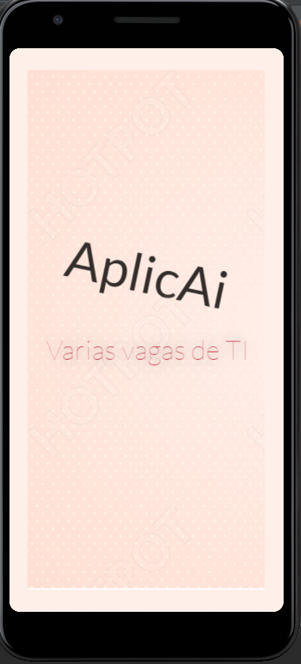
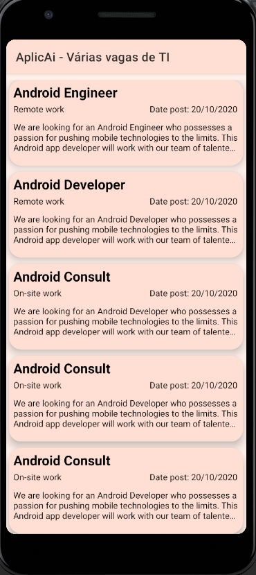

  

# AplicAi - Varias vagas de TI

AplicAi é um projeto ainda em construção voltado para encontrar oportunidades na area de TI facilmente, sem varios e varios cadastros ou imensas propagandas.
Tudo de graça. ALL FREE.
  
  

# Application Functions

#### #0 - Splashscreen.

#### #1 - See all Jobs opportunities easily.

# AplicaAi use the following technologies to work:

<!-- Badges -->

# Architecture

  
  
  
  

